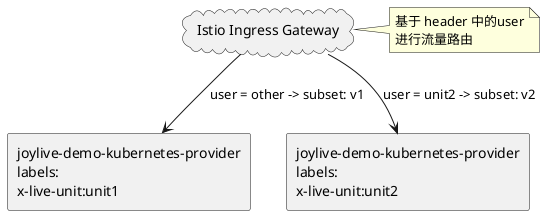

# Joylive Demo Kubernetes Provider

## Getting Started

部署后的架构图和路由逻辑如下：


### 前置条件

1. 安装了 Kubernetes 集群，本例使用Minikube演示。
2. 安装了 Istio 1.20.0 及以上版本

### 部署 Provider 应用

编译项目：

```bash
mvn clean package -DskipTests
```

进入joylive-demo-kubernetes-provider目录，构建Docker镜像：

```bash
cd joylive-agent/joylive-demo/joylive-demo-kubernetes/joylive-demo-kubernetes-provider
docker build -t joylive-demo-kubernetes-provider:1.5.0 .
```

将镜像加载到Minikube中：

```bash
minikube image load joylive-demo-kubernetes-provider:1.5.0
```

本项目的应用都部署在`envoy-managed`命名空间中，在部署应用之前，先配置istio，使envoy-managed命名空间中的应用能够被istio管理。

```bash
kubectl label namespace envoy-managed istio-injection=enabled


```

部署应用并确保svc和pods都正常启动：

```bash
kubectl apply -f deployment.yaml

# 查看svc
kubectl get svc -n envoy-managed
NAME                               TYPE        CLUSTER-IP      EXTERNAL-IP   PORT(S)   AGE
joylive-demo-kubernetes-provider   ClusterIP   10.98.222.216   <none>        80/TCP    19h

# 查看pods

kubectl get pods -n envoy-managed
NAME                                                      READY   STATUS    RESTARTS   AGE
joylive-demo-kubernetes-provider-unit1-887687f94-g54jl    2/2     Running   0          30m
joylive-demo-kubernetes-provider-unit2-67b59686fc-krp6b   2/2     Running   0          30m

```

部署istio路由，确保Gateway、VirtualService和DestinationRule都正常启动：

```bash
kubectl apply -f istio_routes.yaml

# 查看gateway

kubectl get gateways.networking.istio.io -n envoy-managed
NAME                                       AGE
joylive-demo-kubernetes-provider-gateway   16h

# 查看virtualservice

kubectl get virtualservice -n envoy-managed
NAME                               GATEWAYS                                       HOSTS   AGE
joylive-demo-kubernetes-provider   ["joylive-demo-kubernetes-provider-gateway"]   ["*"]   16h

# 查看destinationrule

kubectl get destinationrule -n envoy-managed
NAME                               HOST                               AGE
joylive-demo-kubernetes-provider   joylive-demo-kubernetes-provider   16h

```

使用minikube tunnel将istio ingressgateway暴露出来，需要输入root密码：

```bash
minikube tunnel
[sudo] password for user:
Status:
	machine: minikube
	pid: 1699281
	route: 10.96.0.0/12 -> 192.168.49.2
	minikube: Running
	services: [istio-ingressgateway]
    errors:
		minikube: no errors
		router: no errors
		loadbalancer emulator: no errors
```

再开启一个新的终端，查看istio-ingressgateway的ip地址，可以看到EXTERNAL-IP为10.99.88.250：

```bash
kubectl get svc -n istio-system
NAME                   TYPE           CLUSTER-IP       EXTERNAL-IP    PORT(S)                                                                      AGE
istio-egressgateway    ClusterIP      10.101.127.194   <none>         80/TCP,443/TCP                                                               16h
istio-ingressgateway   LoadBalancer   10.99.88.250     10.99.88.250   15021:31709/TCP,80:30569/TCP,443:30555/TCP,31400:31849/TCP,15443:30162/TCP   16h
istiod                 ClusterIP      10.96.239.153    <none>         15010/TCP,15012/TCP,443/TCP,15014/TCP                                        12d
```

使用curl访问，可以看到当请求携带header中的user为unit2时，流量被路由到单元2，其他流量默认路由到单元1：

```bash
curl  "http://10.99.88.250/echo/abc" -H "User: unit2"
{
  "code" : 200,
  "traces" : [ {
    "service" : "service-provider",
    "location" : {
      "liveSpaceId" : "v4bEh4kd6Jvu5QBX09qYq-qlbcs",
      "unit" : "unit2",
      "cell" : "cell2",
      "ruleId" : "rule2",
      "laneSpaceId" : "2",
      "lane" : "production",
      "ip" : "10.244.0.48"
    },
    "transmission" : {
      "carrier" : "header"
    }
  } ],
  "data" : "abc"
}

curl  "http://10.99.88.250/echo/abc" -H "User: unit3"
{
  "code" : 200,
  "traces" : [ {
    "service" : "service-provider",
    "location" : {
      "liveSpaceId" : "v4bEh4kd6Jvu5QBX09qYq-qlbcs",
      "unit" : "unit1",
      "cell" : "cell1",
      "ruleId" : "rule1",
      "laneSpaceId" : "1",
      "lane" : "production",
      "ip" : "10.244.0.47"
    },
    "transmission" : {
      "carrier" : "header"
    }
  } ],
  "data" : "abc"
}
```

